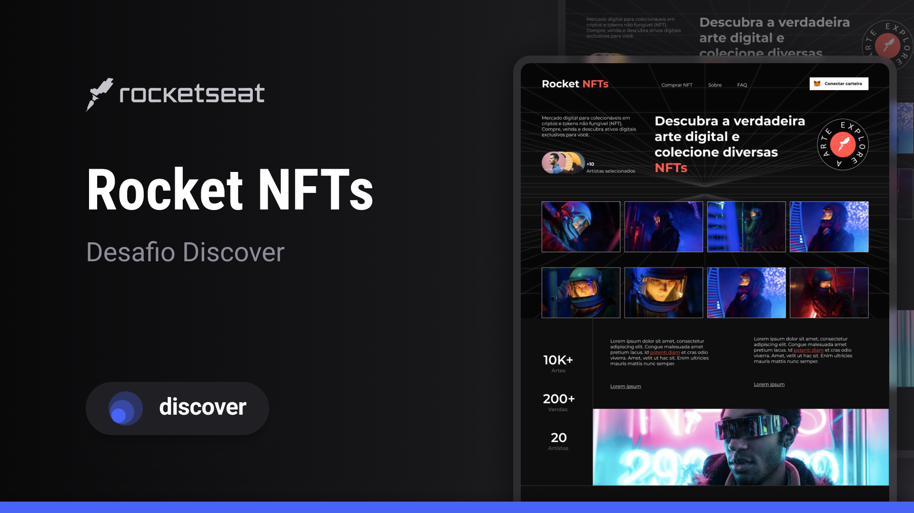

# Desafio: Rocket NFTs

Criado em: 5 de junho de 2023 17:32
Nível: Avançado
Tags: CSS, HTML

## **Índice**

# 💻 Sobre o desafio

---

Neste desafio você deverá desenvolver uma landing page completa sobre NFTs.

## Layout



<aside>
🎨 <strong>Acesse o layout no Figma aqui:</strong>

[Rocket NFTs • Desafio Discover](https://www.figma.com/community/file/1241110107925256789)

</aside>

<aside>
⬇️ <strong>Assets e maiores informações aqui:</strong>

[Guia Rocket NFTs NOTION](https://www.notion.so/player35/Desafio-Rocket-NFTs-0e4c1e34fa054c8fa2c192543878eff0)

</aside>

# 🚀 **Techs**

---

- HTML
- CSS

# 💡**Como começar?**

---

1 - Use o link do Figma como base para o projeto. Também disponibilizamos para download todos os assets necessários (imagens e ícones), para fazer o download basta clicar no link acima.  

2 - Leia com atenção todas as instruções do desafio.

3 - Bora codar! Lembre-se que você pode usar as tecnologias que se sentir mais confortável, mas também pode se desafiar usando novas techs, fazendo modificações e/ou adicionando funcionalidades no projeto como preferir. 🚀

4 - Compartilhe seu resultado ou tire suas dúvidas na nossa [**comunidade aberta**](https://discord.gg/bacwY2gDCF)  

# ✅ **Requisitos**

---

Neste desafio você deverá construir *uma landing page* completa sobre NFTs. 

**Requisitos para o desafio:**

- Seguir o layout do Figma

***Se desafie também:***

- Adicionando animações na landing page
- Fazer a versão responsiva mobile

# 🎨 Style Guide

---

## **Cores:**

```css
:root {
  --body-background: #0e0e0e;
  --color-logo: #ff5b50;
  --card-color: #252525;
  --text-color: #fff;
  --subtitle-color: #5a5757;
  --black-text: #000;
  --color-input: #0D0D0D;
}
```

## **Tipo de fonte:**

font-family: Montserrat 

Font Weight: 400, 500, 700

Você pode encontrar a fonte no [Google Fonts](https://fonts.google.com/) 

# 📅 Entrega

---

Esses desafios **não precisam ser entregues** e não receberão correção. Após concluí-los, adicionar esses códigos ao seu Github é uma boa forma de demonstrar seus conhecimentos para oportunidades futuras.

Feito com 💜 por Rocketseat 👋 Participe da nossa [comunidade aberta](https://discord.gg/bacwY2gDCF)!
